---
title: Two-dimensional functions
inputs: paraboloid nearest rectangle scattered compwater
tags: FUNCTION := FILE_PATH DATA INTERPOLATION nearest rectangle PRINT_FUNCTION MIN MAX STEP NUMBER FILE OUTPUT_FILE 
...

-------

:::{.text-center}
[Previous](../008-integrals) | [Index](../) | [Next](../012-mechanics)
:::

# Two-dimensional functions


These examples illustrate the facilities wasora provides to interpolate two-dimensional functions. As shown in section [007-functions], multidimensional functions may be defined using algebraic expressions, inline data, external files, vectors or dynamically-loaded routines. The main focus of this section is to illustrate the difference between algebraic and pointwise-defined two-dimensional functions, and to further illustrate the difference between a nearest-neighbor interpolation (based on a $k$-dimensional tree structure) and a rectangle interpolation (based on finite-elements-like shape functions for quadrangles).

## paraboloid.was

This input defines an algebraic function $f(x,y)$ and uses `PRINT_FUNCTION` to dump its contents (as three columns containing $x$, $y$ and $f(x,y)$ as shown in the terminal mimic) to the standard output. The range is mandatory because $f(x,y)$ is defined by an algebraic expression.

As far as the function $f(x,y)$ is concerned, $a$ and $b$ are taken as parameters. Even though they can change over time, the value they take is the value they have when $f(x,y)$ is evaluated. In this case, $f(x,y)$ is evaluated when the instruction `PRINT_FUNCTION` is executed, so the output is written with $b=2$.

```wasora
a = 1
b = 1

f(x,y) := (x/a)^2 + (y/b)^2

b = 2

# range is mandatory as f(x,y) is algebraically-defined
PRINT_FUNCTION f MIN -b -b MAX b b STEP b/20 b/20
```

```bash
$ wasora paraboloid.was > paraboloid.dat
$ head paraboloid.dat
-2	-2	5
-2	-1.9	4.9025
-2	-1.8	4.81
-2	-1.7	4.7225
-2	-1.6	4.64
-2	-1.5	4.5625
-2	-1.4	4.49
-2	-1.3	4.4225
-2	-1.2	4.36
-2	-1.1	4.3025
$ gnuplot paraboloid.gp
$ 
```


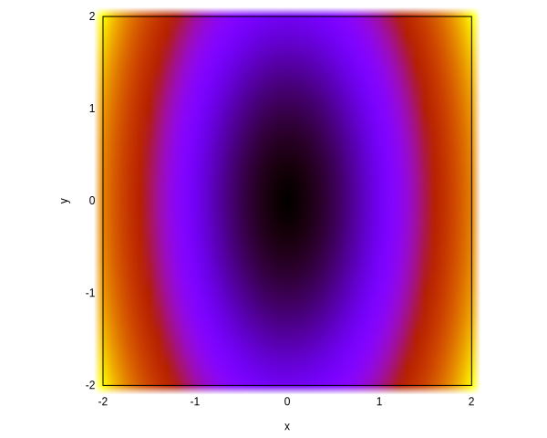

## nearest.was

This input defines a two-dimensional pointwise-defined function $g(x,y)$ using data inlined in the input file using the `DATA` keyword. As can be seen, expressions are allowed. However, they are evaluated at parse-time so references to variables should be avoided, as they will default to zero. For that end, numbers defined with the `NUMBER` keyword should be used. By default, pointwise-defined multidimensional functions are interpolated by the nearest neighbor algorithm (i.e. default is `INTERPOLATION nearest`). When calling `PRINT_FUNCTION` with no range, the definition points are printed. When a range is given, the function gets evaluated at the grid points.

In this case, first the function $g(x,y)$ is dumped into a file called `g_def.dat` with no range. Then, the function is dumped into a file called `g_int.dat` using a range and thus resulting in an interpolated output using nearest neighbors.

```wasora
FUNCTION g(x,y) DATA {
0    0    1-1
0    1    1-0.5
0    2    1
1    0    1
1    1    1+0.25
1    2    1
2    0    1-0.25
2    1    1+0.25
2    2    1+0.5
}

# print g(x,y) at the definition points
PRINT_FUNCTION g FILE_PATH g_def.dat

# print g(x,y) at the selected range
# by defaults wasora interpolates using nearest neighbors
PRINT_FUNCTION g FILE_PATH g_int.dat MIN 0 0 MAX 2 2 STEP 0.05 0.05
```

```bash
$ wasora nearest.was
$ gnuplot nearest.gp
$ 
```

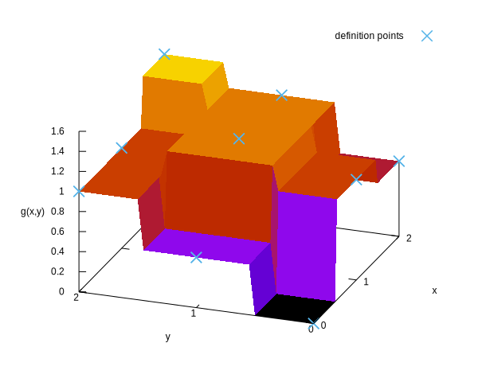

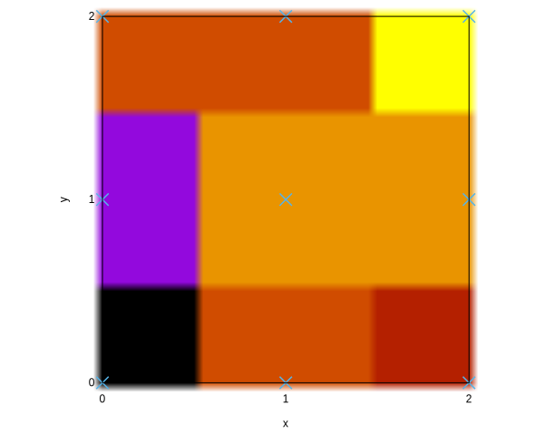


## rectangle.was

This time, a function $h(x,y)$ is defined by reading point-wise data from a file. This file is `g_def.dat` which are the definition points of the function $g(x,y)$ of the previous example. Note that when reading function data from a file, no expressions are allowed. Function $h(x,y)$ is interpolated using the `rectangle` method. The interpolated data is written in a file called `h_int.dat`, in which the function $h(x,y)$ is evaluated at the very same points the function $g(x,y)$ of the previous example was.

```wasora
# h(x,y) is equal to g(x,y) at the definition points,
# but it is interpolated differently
FUNCTION h(x,y) INTERPOLATION rectangle FILE_PATH g_def.dat

# print h(x,y) at the selected range
PRINT_FUNCTION h FILE_PATH h_int.dat MIN 0 0 MAX 2 2 STEP 0.05 0.05
```

```bash
$ cat g_def.dat
0	0	0
0	1	0.5
0	2	1
1	0	1
1	1	1.25
1	2	1
2	0	0.75
2	1	1.25
2	2	1.5
$ wasora rectangle.was
$ gnuplot rectangle.gp
$ 
```

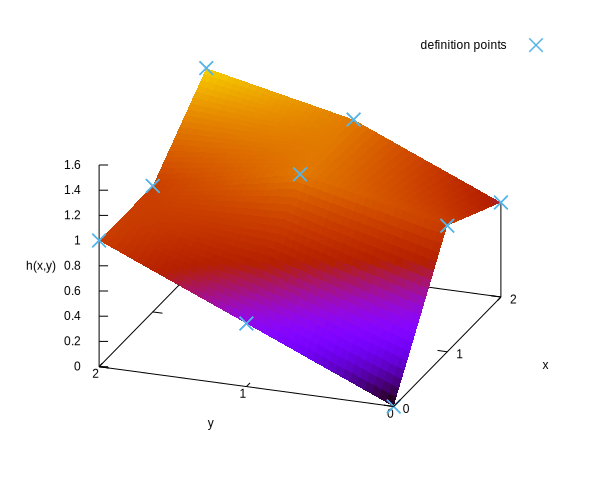

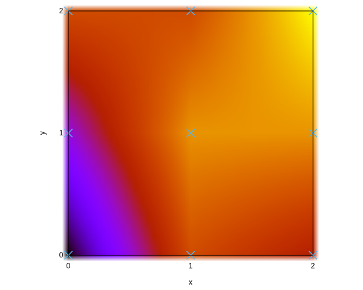

## scattered.was

The last example of two-dimensional interpolation involves a pointwise-defined function~$s(x,y)$ using scattered data, i.e. not necessarily over a rectangular grid. In this case---and with no information about any underlying finite-element-like mesh---wasora can use either a nearest-neighbor interpolation or a Shepard-like inverse distance weighting. For the original Shepard method, the only parameter than can be tweaked is the exponent~$p$ of the distance in the weight~$w_i=1/d_i^p$. For the modified Shepard algorithm, the radius~$r$ of the nearest neighbors taken into account is to be provided. These nearest neighbors are found using a $k$-dimensional tree, that is a very efficient way of doing this task. For complex functions, all the alternatives should be investigated taking into account accuracy and code speed. 

```wasora
# scattered multidimensional data may be interpolated
# using a nearest-neighbor approach
FUNCTION n(x,y) INTERPOLATION nearest DATA {
0     0    0
1     0    1
0     1    2
-0.5  0.5  3
-1    -1   2
0.75  0    1.5
0.25  0.25 1
}

# another way of giving the same set of data
VECTOR datax SIZE 7 DATA 0 1 0 -0.5 -1 0.75 0.25
VECTOR datay SIZE 7 DATA 0 0 1  0.5 -1 0    0.25
VECTOR dataz SIZE 7 DATA 0 1 2  3    2 1.5  1

# using shepard's interpolation method
FUNCTION s(x,y) VECTORS datax datay dataz INTERPOLATION shepard SHEPARD_EXPONENT 4

# or using shepard's modified algorithm
FUNCTION m(x,y) VECTORS datax datay dataz INTERPOLATION modified_shepard SHEPARD_RADIUS 2

# print the definition points
PRINT_FUNCTION n FILE_PATH n_def.dat

# print the different functions at the selected range
PRINT_FUNCTION n s m FILE_PATH n_int.dat MIN -1 -1 MAX 1.5 1.5 STEP 0.05 0.05
```

```bash
$ wasora scattered.was
$ gnuplot scattered.gp
$ 
```

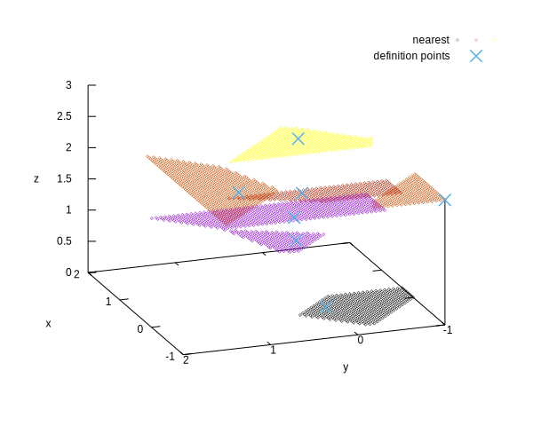

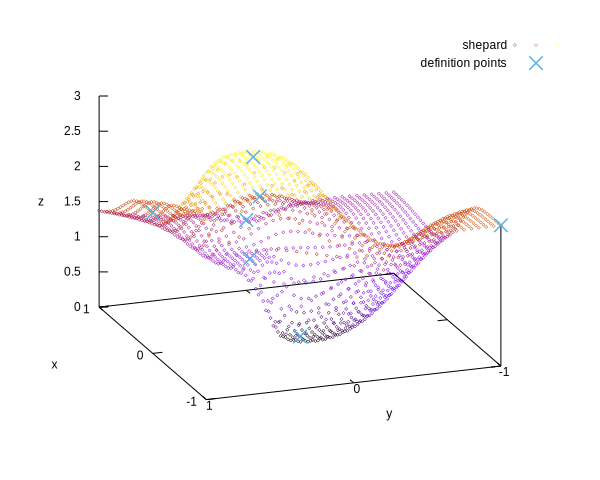

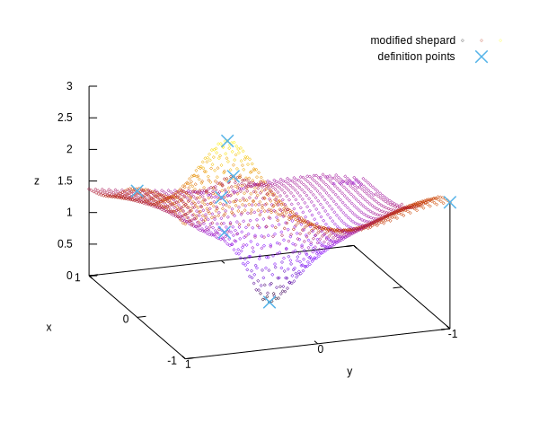

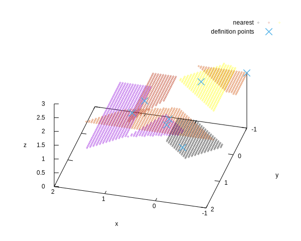


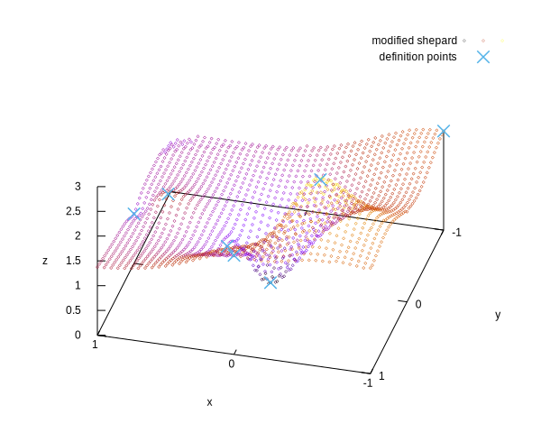

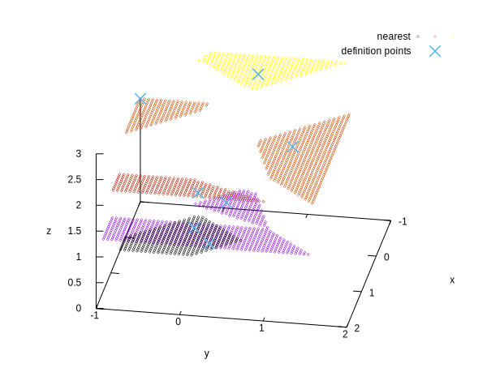

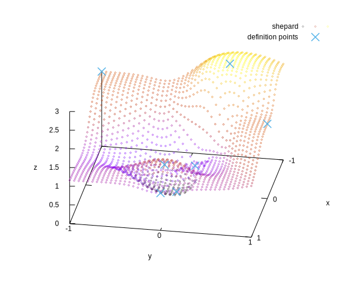

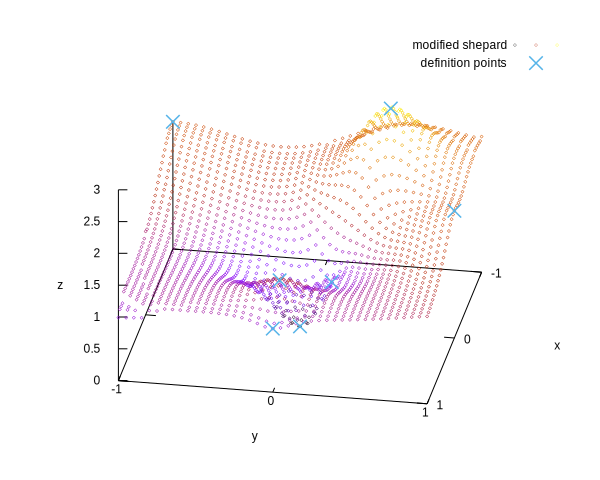

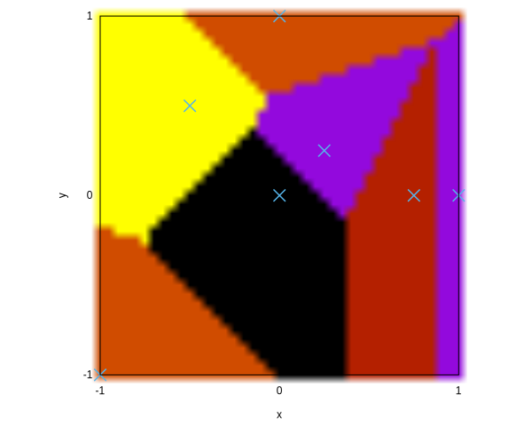

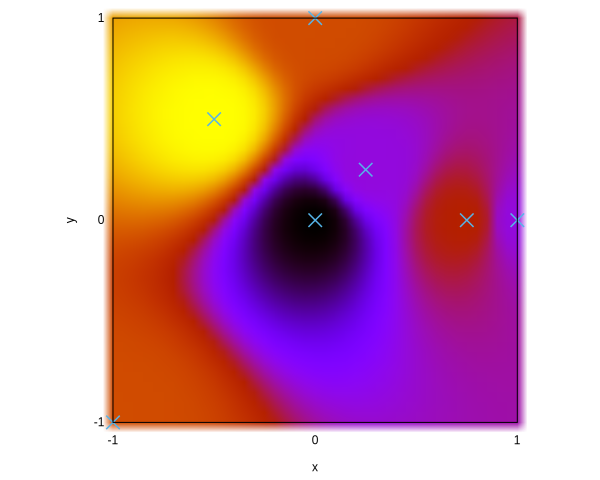


The figures illustrate how the multidimensional data interpolation scheme work for pointwise defined functions over scattered data. Nearest neighbors give constant values for each voronoi triangle whilst Shepard-based algorithms provide continuous surfaces.


## compwater.was

This example shows an extension of the example about saturated water in section ref{007-functions} by giving properties of compressed water as a function of pressure $p$ and temperature $T$. The file `compwater.txt` contains some properties of water as a function of temperature and pressure in a rectangular grid over the pressure-temperature space. The enthalpy is not contained in the file, but it can be computed from pressure $p$, the internal energy $u(p,T)$ and the specific volume $v(p,T)$ as

$$
h(p,t) = u(p,T) + p \cdot v(p,T)
$$


```wasora
FUNCTION v(p,T) FILE_PATH compwater.txt COLUMNS 2 1 4 INTERPOLATION rectangular
FUNCTION u(p,T) FILE_PATH compwater.txt COLUMNS 2 1 5 INTERPOLATION rectangular
FUNCTION h(p,T) = u(p,T) + p*v(p,T)

PRINT_FUNCTION h MIN 1e5 300 MAX 200e5 1000 STEP 2e5 4
```

```bash
$ wasora compwater.was > compwater.dat
$ gnuplot compwater.gp
$ 
```


The figure shows the enthalpy of compressed water as a continuous function of $p$ and $T$ and the discrete experimental data.


-------

:::{.text-center}
[Previous](../008-integrals) | [Index](../) | [Next](../012-mechanics)
:::
