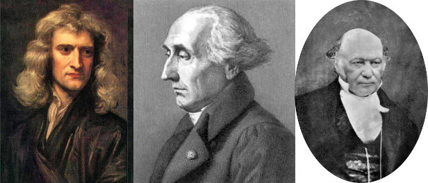
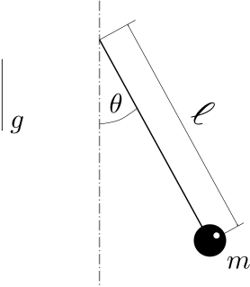
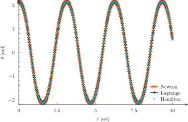
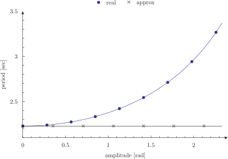

---
title: Newton, Lagrange & Hamilton
inputs: pendulum period-vs-amplitude pendulum-video
tags: INCLUDE PHASE_SPACE = .= := IF ENDIF PARAMETRIC MIN MAX OUTER_STEPS HISTORY HEADER COLUMNS READ ASCII_FILE_PATH MODE derivative sin cos done end_time infinite dt root sqrt
...

-------

:::{.text-center}
[Previous](../010-2dfunctions) | [Index](../) | [Next](../)
:::

# Newton, Lagrange & Hamilton


This is a tale about mixing [GSL](http://www.gnu.org/software/gsl)  and [SUNDIALS](https://computation.llnl.gov/casc/sundials/). It continues on the next chapter.


{.img-responsive}

Once upon a time there were three guys named Isaac, Joseph-Louis and William, respectively. Suddenly, they found a bob of mass\ $m$ hanging from a string of length\ $\ell$ in presence of a gravitational field of intensity\ $g$. They could see a certain angle\ $\theta$ between the string and the vertical direction. They all agreed that\ $\theta=0$ was taken when the bob was at the bottommost position and $\theta>0$ int the counter-clockwise direction.

{.img-responsive}

The first one said, “I think 

$$ m \ell \ddot{\theta} + m g \sin\theta = 0 $$

and as my friend Galileo told me, it can be seen the mass\ $m$ does not matter as it can be taken out of the expression without affecting\ $\dot{\theta}$ .” “Let me see if it matters or not”---replied Joseph-Louis. “It seems to me that

$$ \frac{d}{dt} \left( \frac{\partial \mathcal{L}}{\partial \dot{\theta}} \right) = \frac{\partial \mathcal{L}}{\partial \theta} $$

where

$$ \mathcal{L}(\theta, \dot{\theta}) = \frac{1}{2} m (\ell \dot{\theta})^2 + mg\ell \cos\theta $$

and apparently\ $m$ appears in both sides, so I agree with Isaac that it should not matter after all.” Finally, William said “I like your idea, but what about if

$$
\dot{\theta}   = +\frac{\partial \mathcal{H}}{\partial p_\theta}
$$

$$
\dot{p}_\theta = -\frac{\partial \mathcal{H}}{\partial \theta}
$$

where now

$$
\mathcal{H}(\theta, p_\theta) = \frac{p_\theta^2}{2m\ell^2} - mg\ell \cos\theta
$$

Mmmmmm. How can you two tell me\ $m$ does not matter?”


## pendulum.was


So, after the tailor-made joke, we thus proceed to solve the simple pendulum using the three discussed approaches. In order to do that, we prepare a main input file that defines the parameters of the problem and writes the output, but includes the filename indicated in the commandline containing the actual equations to solve. The three options of included files are:

Newton’s equations in `newton.was`, reduced from a single second-order differential equation to two first-order equations:

```wasora
PHASE_SPACE theta omega

0 .= m*l*omega_dot + m*g*sin(theta)
theta_dot .= omega
```

Lagrange’s equations in `lagrange.was`, computed as numerical derivatives using dummy variables of the algebraic Lagrangian written as a wasora function:

```wasora
# lagrangian of the simple pendulum
L(theta,thetadot) := 1/2*m*(l*thetadot)^2 + m*g*l*cos(theta)

# lagrange equations
PHASE_SPACE theta dL_dthetadot 
VAR theta' theta_dot'

dL_dthetadot     .= derivative(L(theta, theta_dot'), theta_dot', theta_dot)
dL_dthetadot_dot .= derivative(L(theta', theta_dot), theta', theta)
```

Hamilton equations in `hamilton.was`, idem:

```wasora
# hamiltonian of the simple pendulum
H(theta,p_theta) := p_theta^2/(2*m*l^2) - m*g*l*cos(theta) 

# hamilton equations
PHASE_SPACE theta p_theta
VAR theta' p_theta'

theta_dot    .= +derivative(H(theta, p_theta'), p_theta', p_theta)
p_theta_dot  .= -derivative(H(theta', p_theta), theta', theta)
```


The main input is called `pendulum.was`, and the formulation used to solve the problem is selected from the commandline using the replacement mechanism of the construction `$1` in the wasora input file:


```wasora
# parameters of the pendulum, assumed in SI units
m = 1.111
l = 1.234
g = 9.806

# initial conditions
theta_0 = pi-1
INITIAL_CONDITIONS_MODE FROM_VARIABLES

# running time
end_time = 10

# include the equations to solve according to
# the commandline argument
INCLUDE $1.was


# write a header with some information
IF in_static
 PRINT "\# $1's simple pendulum"
 PRINT "\# m = " m
 PRINT "\# l = " l
 PRINT "\# g = " g
ENDIF

# and at all times, theta and theta_dot vs time
PRINT t theta theta_dot
```

```bash
$ wasora pendulum.was newton   > newton.dat
$ wasora pendulum.was lagrange > lagrange.dat
$ wasora pendulum.was hamilton > hamilton.dat
$ pyxplot pendulum.ppl; pdf2svg pendulum.pdf pendulum.svg
$ 
```


{.img-fluid}

It is noteworthy that in both Lagrangian and Hamiltonian formulations, there is no need to manually write the analytical partial derivatives of $\mathcal{L}(\theta, \dot{\theta})$ and $\mathcal{H}(\theta, p_\theta)$. The functional `derivative` provided by wasora can be used to numerically compute the derivative, arriving at a situation where the actual differential equations that [SUNDIALS](https://computation.llnl.gov/casc/sundials/) solves numerically are also numerically computed by [GSL](http://www.gnu.org/software/gsl/). And the users---i.e. you and me---do not need to bother about the details. But even better, we can if we wanted to, because [wasora](https://www.seamplex.com/wasora), [GSL](http://www.gnu.org/software/gsl/) and [SUNDIALS](https://computation.llnl.gov/casc/sundials/) are free software so the source code is avaiable and we have the freedom to modify it.

The figure above shows the angular position $\theta$ vs. time as obtained by the three formulations. As the differential equations are not exactly the same for each case, the time steps chosen by the solver differ and the actual times where the solutions are obtain differ. And as the problem does not have an analytical solution (remember the $\theta(t)$ is not a sine because we are solving the non-linear equation and not the linear approximation $\sin \theta \approx \theta$ for small $\theta$), we cannot plot the actual error comited by each case. Nevertheless, it is clear that the three solutions coincide. It is left as an exercise to the reader---i.e. you---to show that in effect, the mass $m$ does not affect $\theta(t)$.


## period-vs-amplitude.was

```wasora
# parametric computation to study how the period of a single
# pendulum changes with the amplitude
m = 1.111
l = 1.234
g = 9.806

# start with a long end_time, we will finish the solution
# before with the special variable done
end_time = 20

# one hundred steps of parametric study over the amplitude
PARAMETRIC a MIN 1e-3 MAX 0.75*pi OUTER_STEPS 100

# initial condition equal to the parametric variable a
theta_0 = a
INITIAL_CONDITIONS_MODE FROM_VARIABLES

# include the equations to solve according to
# the commandline argument
INCLUDE newton.was

# build a function f(t) with the time history of theta
HISTORY theta f

# end after one single period
done = t>0.9*2*pi*sqrt(l/g) & theta>(0.99*a)

# once we solved up to end_time, we try to locate
# at what times f(t) = 0
IF done
 VAR t'
 approx = 2*pi*sqrt(l/g)
 t1 = root(f(t'), t', 0, t/2)
 t2 = root(f(t'), t', t/2, t)
 real = 2*(t2-t1)
 PRINT a real approx HEADER
ENDIF
```

```bash
$ wasora period-vs-amplitude.was | qdp --xlabel "amplitude [rad]" --ylabel "period [sec]" --yrange "[2.1:3.5]" --pt "17 1" -o period-vs-amplitude
$ 
```


{.img-fluid}


## pendulum-video

```wasora
FUNCTION theta(t) FILE_PATH $1.dat
FUNCTION omega(t) FILE_PATH $1.dat COLUMNS 1 3

VAR m g l
IF in_static
 READ ASCII_FILE_PATH $1.dat m l g
ENDIF

# end after one single period
end_time = infinite
done = omega(t)>0 & theta(t)>(theta(0)-2e-3)
dt = 1/$2

WINDOW WIDTH 480 HEIGHT 480 CAPTION "the simple pendulum" COORDINATES 240 240 200 -200 200

# the center of the bob
x = +sin(theta(t))
y = -cos(theta(t))

# the vertical
SEGMENT X1 0 Y1 0 X2 0 Y2 +1.5  COLOR grey90
SEGMENT X1 0 Y1 0 X2 0 Y2 -1.5  COLOR grey70

# the string
SEGMENT X1 0 Y1 0 X2 x Y2 y

# the bob (and the light reflection)
CIRCLE X x        Y y        R 0.050*m COLOR black
CIRCLE X x+0.02*m Y y+0.02*m R 0.008*m COLOR snow

FILE frame $1-%04g.png step_transient MODE w
BESSSUGO_DRAW
BESSSUGO_DUMP FILE frame
```

```bash
$ besssugo pendulum-video.was newton 48
$ avconv -y -v quiet -f image2 -framerate 48 -i newton-%04d.png -r 48 newton.webm
$ rm -f newton-*.png
$ 
```

<video width="480" height="480" autoplay loop class="img-fluid">
 <source src="newton.webm" type="video/webm">
 <source src="newton.mp4" type="video/mp4">
 Your browser does not support the video tag.
</video> 


-------

:::{.text-center}
[Previous](../010-2dfunctions) | [Index](../) | [Next](../)
:::
